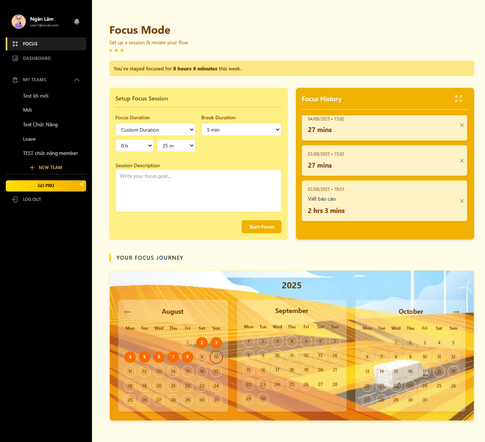
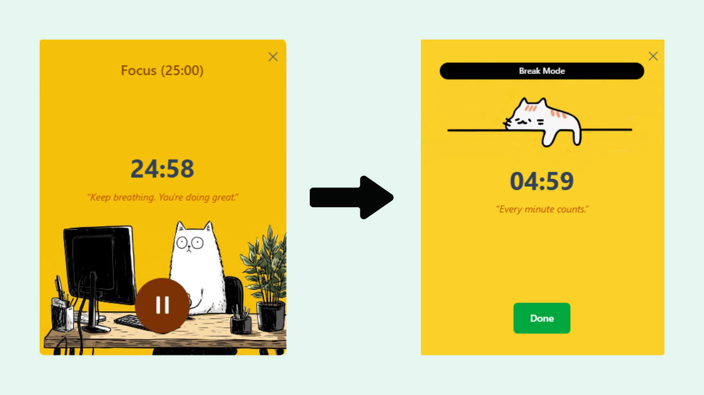
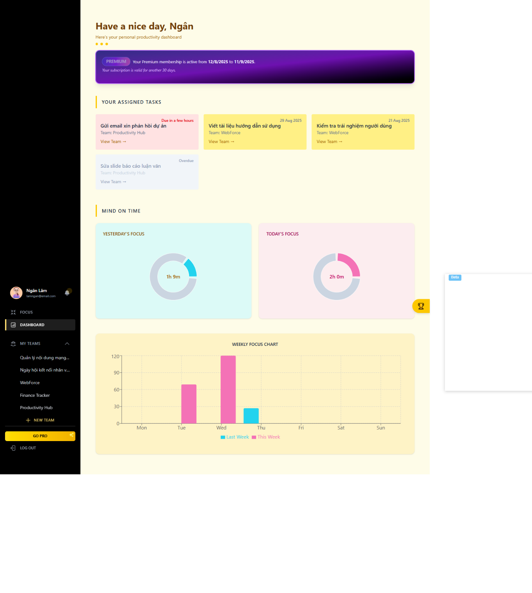
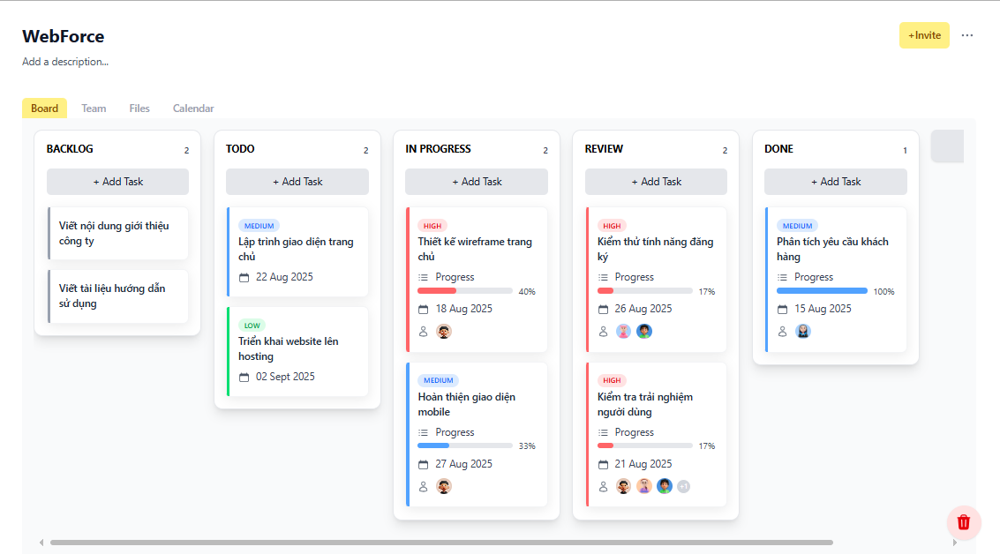
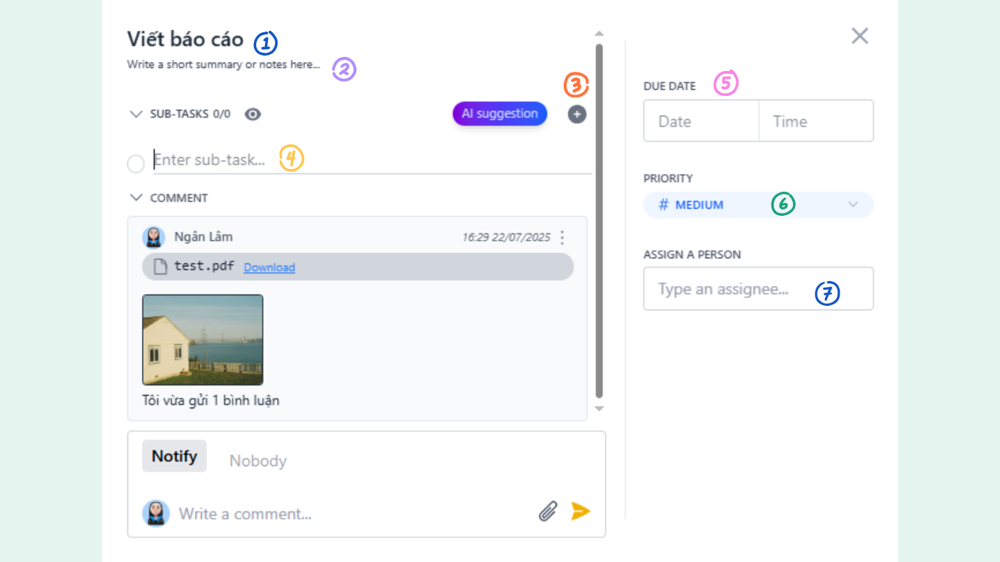
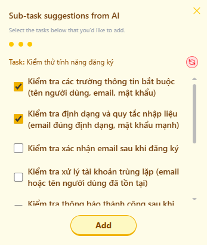
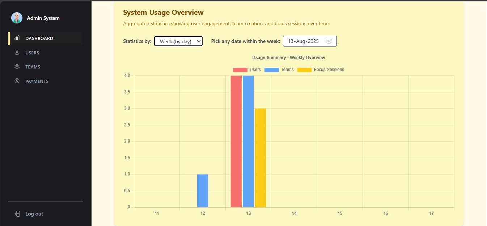

📖 Tóm tắt  
Đề tài “Xây dựng website quản lý công việc dùng Java Spring Boot, ReactJS và MySQL có tích hợp máy học” tập trung phát triển một nền tảng quản lý công việc và lịch trình cá nhân, đồng thời hỗ trợ làm việc nhóm hiệu quả.  
🎯 Mục tiêu 
- Hỗ trợ người dùng lập kế hoạch, phân công công việc nhóm và duy trì thói quen làm việc hiệu quả.
- Ứng dụng AI (mô hình ngôn ngữ lớn) để phân tích đầu vào công việc, gợi ý phân rã thành các nhiệm vụ nhỏ phù hợp.
- Tích hợp ba phương pháp quản lý thời gian phổ biến: Pomodoro, Flowtime và Kanban.
- Xây dựng giao diện thân thiện, dễ sử dụng, cho phép tạo sự kiện, công việc, đặt nhắc nhở và theo dõi tiến độ.
- Tạo môi trường làm việc đồng bộ, kết nối các thành viên trong nhóm, nâng cao hiệu suất làm việc nhóm.
## Minh họa giao diện

### Landing Page

### Focus Mode
- Hẹn giờ cho từng phiên làm việc tập trung.
- Xem lại lịch sử các phiên đếm giờ đã hoàn thành.
- Theo dõi chuỗi ngày tập trung (**streak**) để duy trì thói quen làm việc hiệu quả.

### Timer
Chức năng hẹn giờ giúp người dùng quản lý thời gian làm việc hiệu quả hơn.  
- Cho phép tùy chỉnh thời lượng phiên làm việc và nghỉ ngơi.
- Hiển thị trực quan tiến trình đếm ngược, giúp duy trì sự tập trung.

### User Dashboard
Giao diện User Dashboard được triển khai nhằm giúp người dùng theo dõi hiệu suất làm việc một cách trực quan.  
- Hiển thị **biểu đồ thời gian tập trung**, so sánh giữa ngày hôm qua và hôm nay.
- Liệt kê các công việc đang thực hiện, giúp nắm bắt tiến độ rõ ràng.

### Workspace
Giao diện Workspace cho phép người dùng quản lý toàn bộ công việc và dự án trong một không gian tập trung.  
- Tạo và sắp xếp các cột hay các thẻ nhiệm vụ theo phương pháp Kanban.
- Theo dõi tiến độ và trạng thái công việc.
- Cộng tác với thành viên khác trong nhóm.
- Dễ dàng chuyển đổi giữa các chế độ hiển thị (Bảng, danh sách thành viên, lịch).

### Task
Người dùng có thể chỉnh sửa, thay đổi trạng thái, thêm ghi chú hoặc cập nhật tiến độ cho từng nhiệm vụ.

### Gợi ý công việc từ AI
Tích hợp AI để gợi ý các nhiệm vụ con. Nhờ đó, người dùng tiết kiệm thời gian lập kế hoạch và có định hướng rõ ràng hơn trong quá trình làm việc. 

### Admin Dashboard

