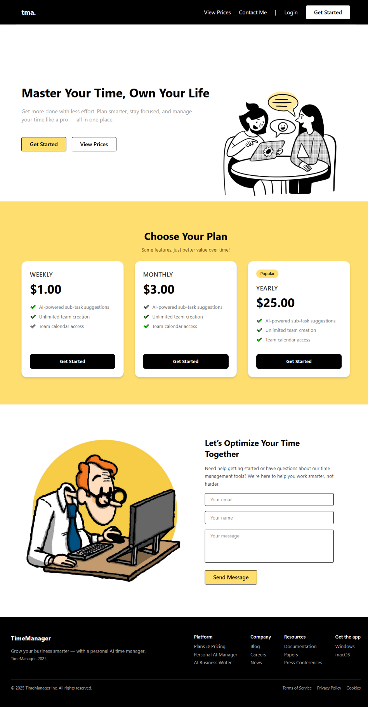

📖 Tóm tắt đề tài  
Đề tài “Xây dựng website quản lý công việc dùng Java Spring Boot, ReactJS và MySQL có tích hợp máy học” tập trung phát triển một nền tảng quản lý công việc và lịch trình cá nhân, đồng thời hỗ trợ làm việc nhóm hiệu quả.
🎯 Mục tiêu
- Hỗ trợ người dùng lập kế hoạch, phân công công việc nhóm và duy trì thói quen làm việc hiệu quả.
- Ứng dụng AI (mô hình ngôn ngữ lớn) để phân tích đầu vào công việc, gợi ý phân rã thành các nhiệm vụ nhỏ phù hợp.
- Tích hợp ba phương pháp quản lý thời gian phổ biến: Pomodoro, Flowtime và Kanban.
- Xây dựng giao diện thân thiện, dễ sử dụng, cho phép tạo sự kiện, công việc, đặt nhắc nhở và theo dõi tiến độ.
- Tạo môi trường làm việc đồng bộ, kết nối các thành viên trong nhóm, nâng cao hiệu suất làm việc nhóm.
## 🌐 Landing Page

